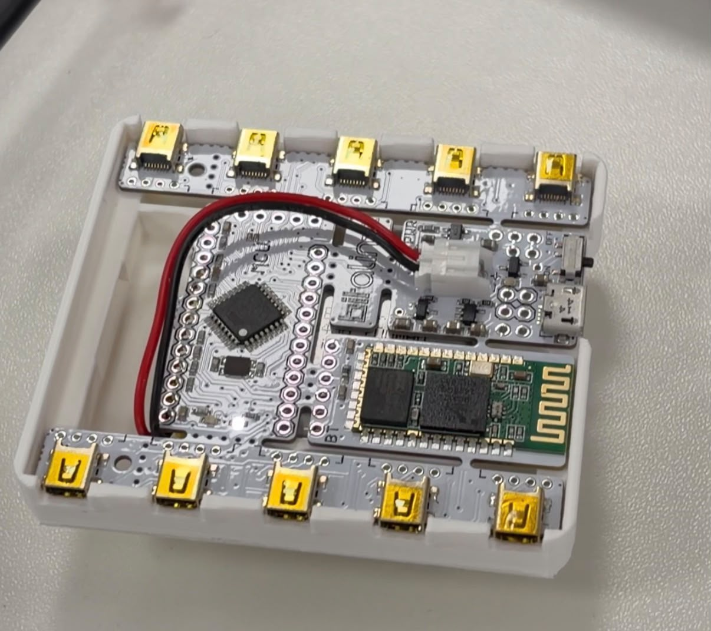
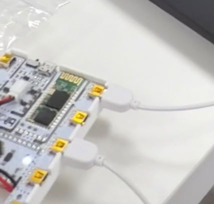
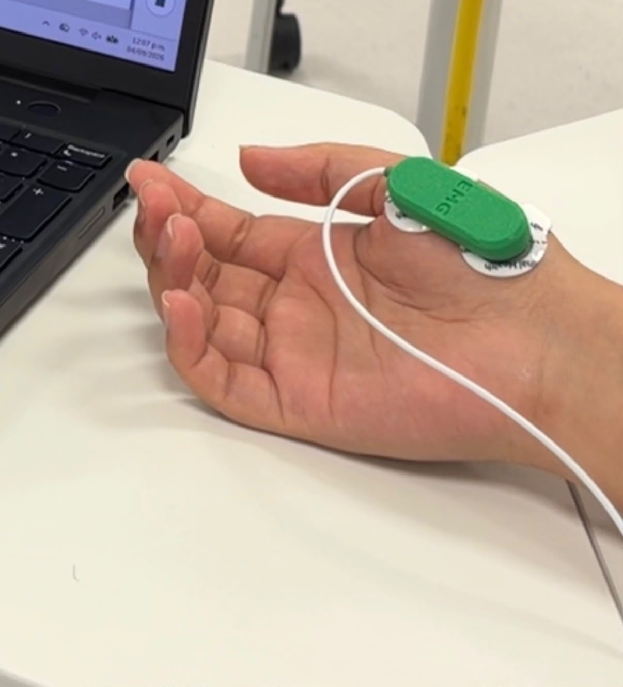
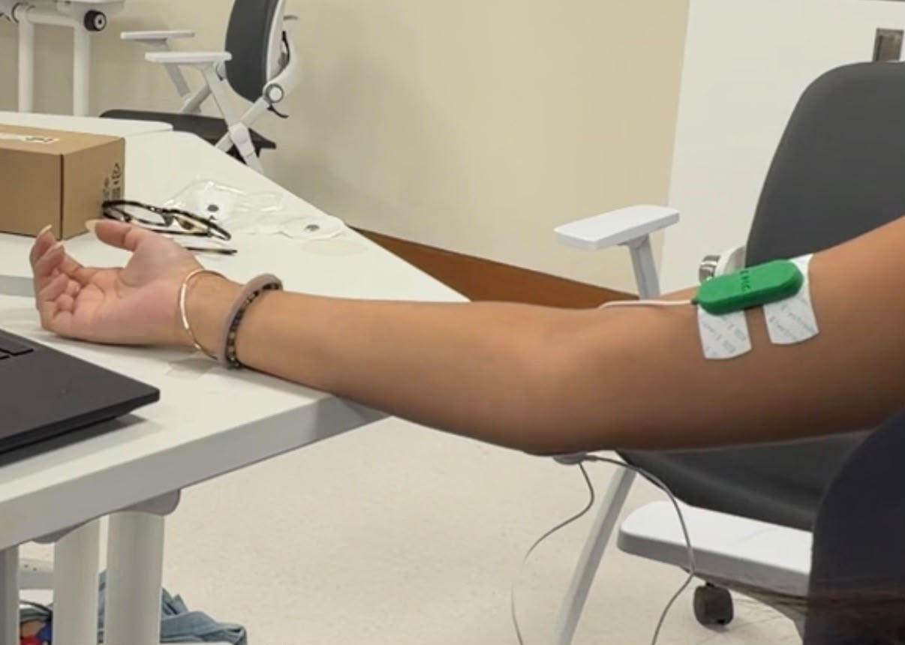
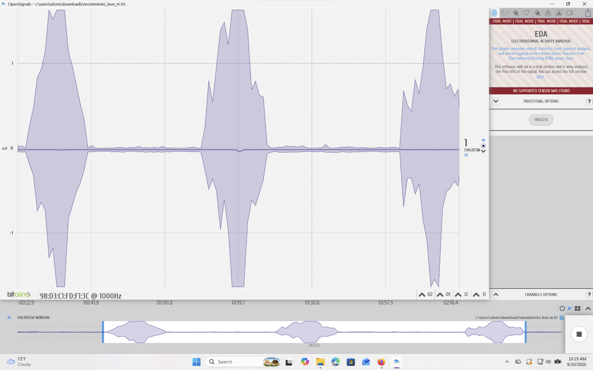
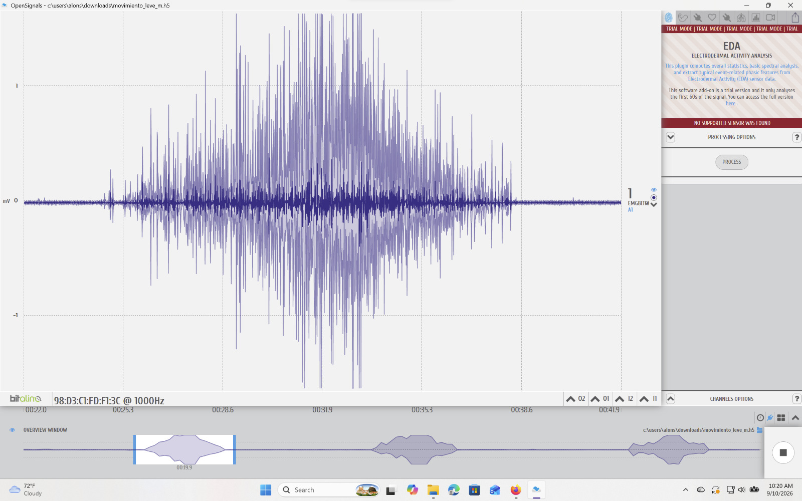
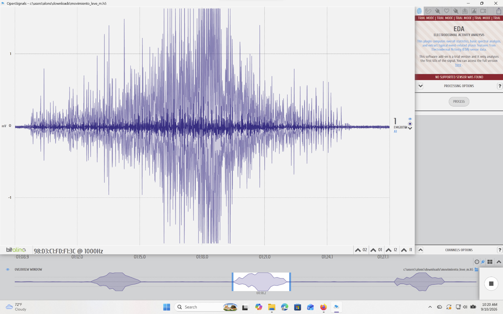
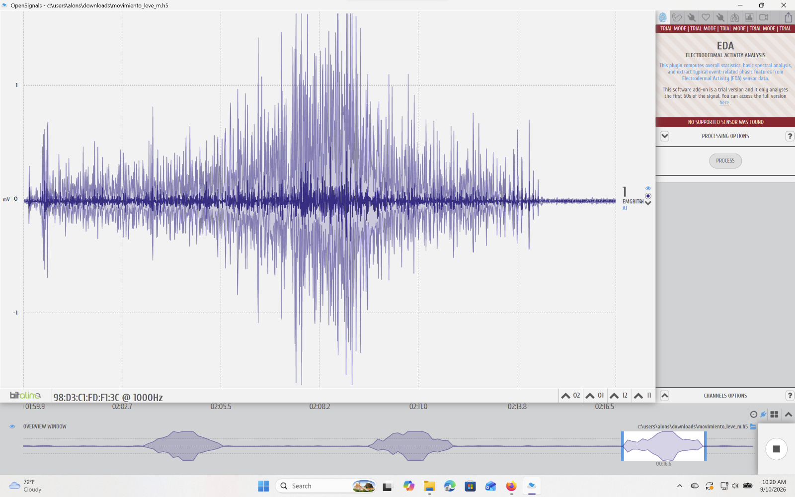
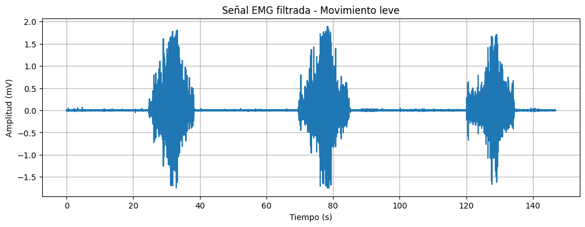

# Entregable laboratorio 3
## Fotos de conexión usada

Figura 1. Conexión BITalino.

Las entradas utilizadas fueron:
- A1: electrodos de medición.
- A3: electrodo de referencia.

Evaluamos 2 grupos musculares:
- Abductor corto del pulgar

Figura 2. Colocación de los electrodos para la medición del músculo abductor corto del pulgar.

- Biceps braquial

Figura 3. Colocación de los electrodos para la medición del músculo abductor corto del pulgar.

Ambos con el electrodo de referencia colocado en el codo.

**Para los siguientes apartados se analizará únicamente la señal correspondiente al abductor corto del pulgar durante el movimiento leve, ya que las indicaciones del entregable solicitan la presentación y análisis de una señal EMG.**

## Video de señal en silencio eléctrico o reposo, que se muestre las conexiones electrodos-cuerpo y señal ploteada.

<video controls width="400">
  <source src="imagenes/video_reposo.mp4" type="video/mp4">
</video>

En caso no se pueda visualizar:
[Ver video de la señal en reposo eléctrico](https://drive.google.com/file/d/1pIsKsDOebBdgiCkUKJ59qZzmJKG6_asf/view?usp=sharing)

## Ploteo de la señal en OpenSignals.

Figura 4. Señal obtenida tras realizar tres reoeticiones de movimientos leve del músculo abductor corto del pulgar.

Figura 5. Acercamiento de las repeticiones individuales.

## Resumen y explicacion de la señal ploteada
En la gráfica general (Figura 4) se observa inicialmente una actividad cercana a cero, correspondiente al estado de reposo del músculo. Posteriormente aparecen tres zonas de mayor amplitud asociadas a las contracciones musculares realizadas durante la prueba.

En las ampliaciones de cada repetición (Figura 5) se puede observar que, durante la activación muscular, la señal presenta un incremento considerable en su amplitud debido al reclutamiento de fibras musculares y al aumento de la actividad eléctrica generada por el músculo. Entre cada contracción se observa nuevamente una disminución de la señal, correspondiente al periodo de relajación muscular.
Las e repeticiones presentan un comportamiento bastante similar,on una etapa de activación donde aumenta la variabilidad y amplitud de la señal, seguida por una etapa de recuperación. 
Estas presentan pequeñas diferencias que pueden ser debido a variaciones en el movimiento y fuerza aplicada, la posición del músculo o a presencia de ruido durante la adquisición de los datos. 

## Archivo de datos de la señal EMG
Este archivo contiene los datos adquiridos durante la medición electromiográfica realizada con el el laboratorio. Estos valores fueron utilizados para la generación de la gráfica presentada en el inciso anterior.

[Descargar archivo de datos EMG](movimiento_leve_m.txt)

## Ploteo de la señal en Python
El procesamiento y la visualización de la señal EMG fueron realizados utilizando Python mediante Google Colab.

[Notebook de Python utilizado para el procesamiento de la señal EMG](https://colab.research.google.com/drive/1jjA38OHkQ9hc_EmErpBSpBZvFwGURr1F?usp=sharing)

Figura 6. Señal ploteada en python.

