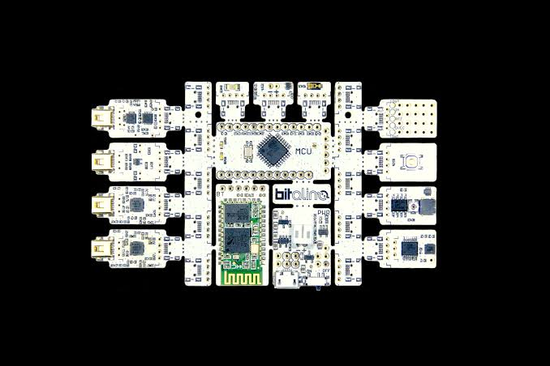
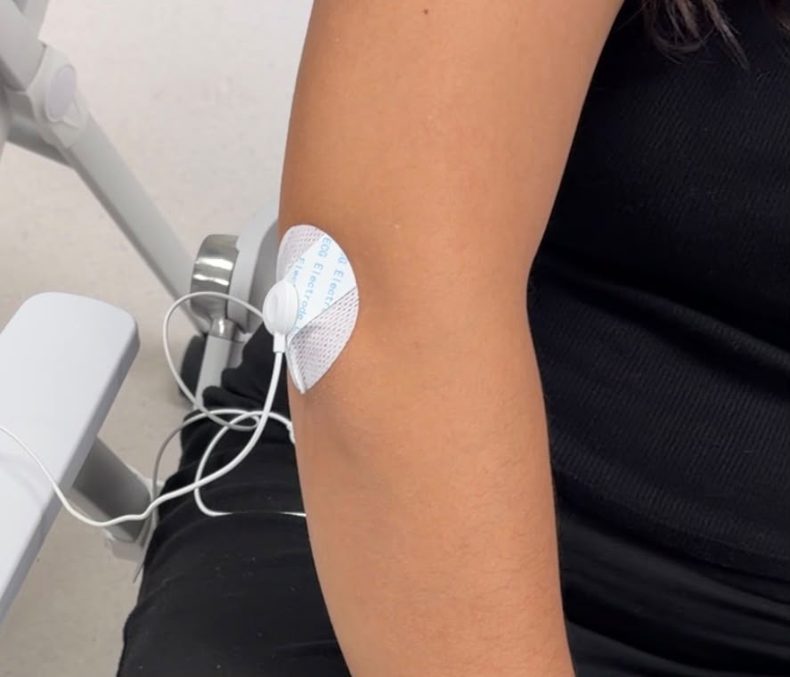

## Laboratorio N3: Adquisición de señales EMG mediante BITalino

Esta sesión de laboratorio tuvo como objetivo comprender el proceso de adquisición de señales biomédicas utilizando BITalino (r)evolution, con enfoque principalmente en la señal EMG. Durante la sesión se revisó tanto el funcionamiento del hardware utilizado como el proceso de configuración del sistema, conexión de electrodos, adquisición de datos y visualización de las señales obtenidas mediante el software OpenSignals.

La electromiografía puede realizarse principalmente mediante dos métodos de adquisición: electromiografía de superficie (sEMG) y electromiografía intramuscular de aguja.

### Electromiografía de superficie (sEMG)
Consiste en registrar la actividad electrica del músculo mediantes electrodos que se colocan sobre la piel. 
Debido a que es un método no invasivo, es ampliamente utilizado en estudios de movimiento, rehabilitación y análisis deportivo.

### Electromiografía intramuscular (iEMG)
Se utiliza un electrodo en forma de auja que se introduce en el músculo directamente para registrar una actividad muscular mas específica.
Se emplea principalmente en aplicaciones clínicas, como el diagnóstico de alteraciones neuromusculares, evaluación de lesiones nerviosas o estudio de enfermedades que afectan la función muscular.

**En esta práctica utilizamos la electromiografía de superficie, debido a que el objetivo era adquirir y analizar la actividad muscular de manera no invasiva.**

## BITalino
BITalino es una plataforma de adquisición de señales biomédicas diseñada para registrar, procesar y analizar diferentes señales fisiológicas mediante sensores especializados. Permite conectar señales provenientes del cuerpo humano con un sistema digital para su proxima visualización y análisis. 

La versión BITalino (r)evolution, utilizada en esta práctica, corresponde a una evolución del sistema original, que incorpora mejoras enfocadas en facilitar la adquisición de las señales y hacer el dispositivo más práctico para aplicaciones educativas y experimentales. 
A diferencia de otras versiones,integra una comunicación inalámbrica mediante Bluetooth/BLE, que nos permite transmitir los datos adquiridos hacia una computadora sin necesidad de una conexión física directa.

El BITalino permite seleccionar diferentes frecuencias de muestreo:
- 1 Hz
- 10 Hz
- 100  Hz
- 1 kHz

Se desarrollo la práctica usando una frecuencia de muestreo de 1 kHz.

El dispositivo cuenta con:
- 4 entradas analógicas de 10 bits.
- 2 entradas analógicas de 6 bits.
- 1 entrada auxiliar para batería.
- 1 salida analógica de 8 bits.
Entradas y salidas digitales.

El BITalino utiliza una batería recargable LiPo de 3.7 V con capacidad aproximada de 500 mAh.

## Señales EMG y porcesamiento
Para señales EMG el rango de interés varía un poco según el músculo estudiado y la literatura utilizada. Generalmente se considera aproximadamente desde 20 Hz hasta 450 Hz. Sin embargo, existen referencias que amplían el limite superior hasta alrededor de 500 Hz.

Debido a que las señales de este tipo, suelen tener amplitudes muy pequeñas, suelen ser suceptibles a interferencias externas que incorporan ruido a la señal. Se utilizan filtros para su procesamiento.
En el caso de las señales EMG, generalmente se emplean filtros pasa banda que permite conservar las frecuencias asociadas a la actividad muscular y eliminar ruidos de baja precuencia.

## Desarrollo de la práctica
1. Se conectó el BITalino con la computadora mediante Bluetooth.
En OpenSignals se utilizó la opción "Find and configure devices" para detectar el dispositivo disponible y establecer la comunicación.

2. Se configuraron los canales que utilizaríamos, es decir, un canal para los electrodos de medición y otro para el de referencia.

3. Colocamos los electrodos teniendo en cuenta las consideracones para obtener una señal adecuada:
- el electrodo de referencia debe colocarse en una zona estable.
- los electrodos de medicion deben ir en direccion de las fibras musculares y de preferencia en una zona con poco pelo.

4. Se realizaron dos tipos de pruebas:
- Movimiento leve
- Movimiento a contra fuerza
Cada una consistió de 3 repeticiones con descansos de 30 segundos entre pruebas.