# Informe 4 de laboratorio

## Introducción

En el presente laboratorio se realizó la adquisición y análisis de señales de electrocardiografía (ECG) utilizando el sistema BITalino, el software OpenSignals y el sensor de ECG. 

De acuerdo con la guía de BITalino, el ECG permite registrar las variaciones eléctricas asociadas con la actividad del corazón. La señal obtenida está relacionada con las diferentes etapas del ciclo cardíaco, incluyendo las ondas P, el complejo QRS y la onda T. Además, la guía señala que la dirección y amplitud de los componentes de la señal dependen de la orientación del dipolo cardíaco respecto a los electrodos.

Las tres derivaciones de Einthoven permiten observar la actividad eléctrica cardíaca desde diferentes direcciones. La derivación I corresponde a la diferencia de potencial entre el brazo derecho (RA) y el brazo izquierdo (LA), la derivación II entre el brazo derecho y la pierna izquierda (LL), y la derivación III entre el brazo izquierdo y la pierna izquierda.

## Metodología

El experimento consistió en realizar adquisiciones de la señal ECG bajo diferentes condiciones fisiológicas y utilizando las tres derivaciones de Einthoven. Para todas las mediciones se eligió la configuración de los electrodos sobre las clavículas y la cresta ilíaca, realizando los cambios correspondientes en las conexiones para obtener cada una de las derivaciones.

El experimento se dividió en cuatro condiciones principales, realizando las adquisiciones correspondientes para los tres meridianos o derivaciones:

1. **Estado basal** 
2. **Hiperventilación**
3. **Hipoventilación** 
4. **Actividad** 

## Resultados

Las señales obtenidas durante el laboratorio fueron exportadas desde OpenSignals en formato `.txt` y posteriormente procesadas mediante Python. Para cada archivo se identificó la columna correspondiente al canal ECG y se construyó un eje temporal a partir de la frecuencia de muestreo utilizada durante la adquisición. Los gráficos permiten visualizar las diferencias entre las señales registradas en estado basal, durante hiperventilación, hipoventilación y después de realizar actividad física.

### Estado basal

En esta condición se obtuvo la señal ECG correspondiente al estado de reposo para cada una de las tres derivaciones.

#### Derivación I

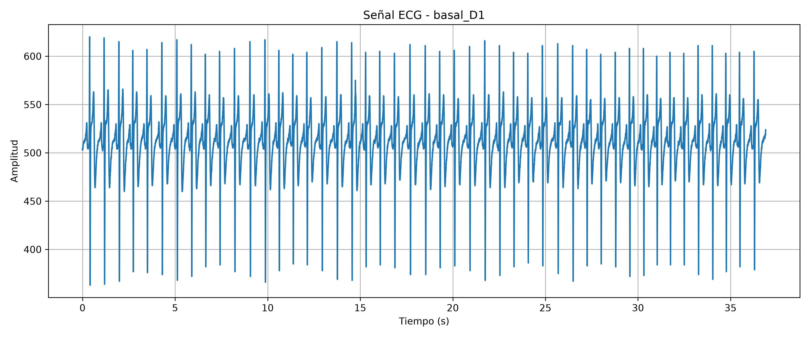

#### Derivación II

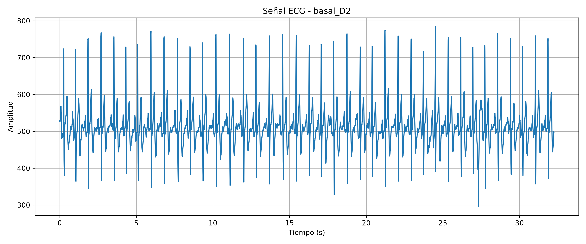

#### Derivación III

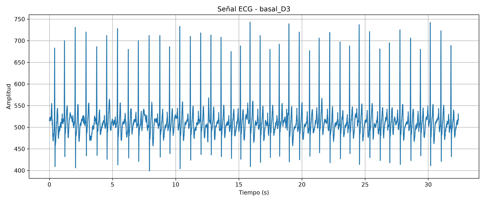

> ANÁLISIS: En la condición basal se obtuvo una señal ECG periódica y bastante regular, correspondiente al estado de reposo del sujeto. Los ciclos cardíacos principalmente por los picos R. Esta medición sirve como referencia para comparar las modificaciones observadas durante las condiciones de hiperventilación, hipoventilación y actividad física.

### Hiperventilación

En esta condición se registró la señal ECG mientras se realizaba una respiración más rápida. Esta adquisición permite evaluar si los cambios en la respiración producen modificaciones observables en la señal ECG.

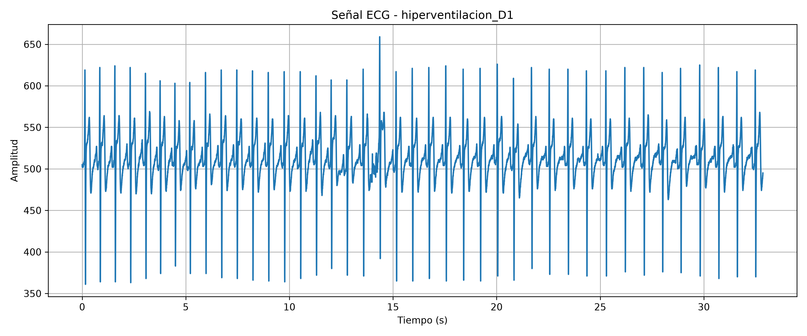

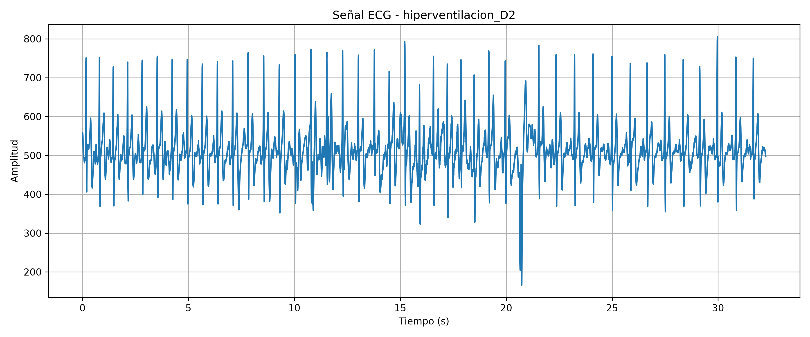

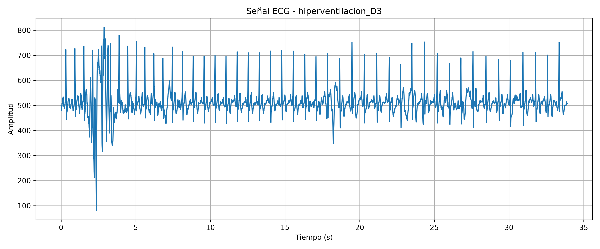

> ANÁLISIS: En la hiperventilación se obtuvo un aumento en la frecuencia y disminución de separación entre los picos R. Se observa más ruido e irregularidades, lo que se produce debido al movimiento respiratorio.

### Hipoventilación

En esta condición se registró la señal ECG durante una respiración reducida. La comparación con el estado basal y con la hiperventilación permite observar posibles modificaciones relacionadas con las condiciones respiratorias.

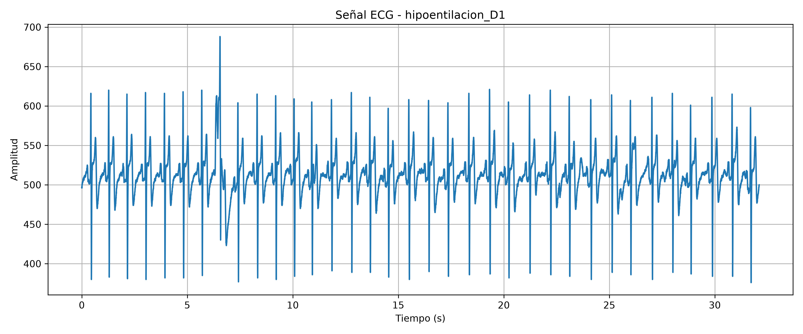

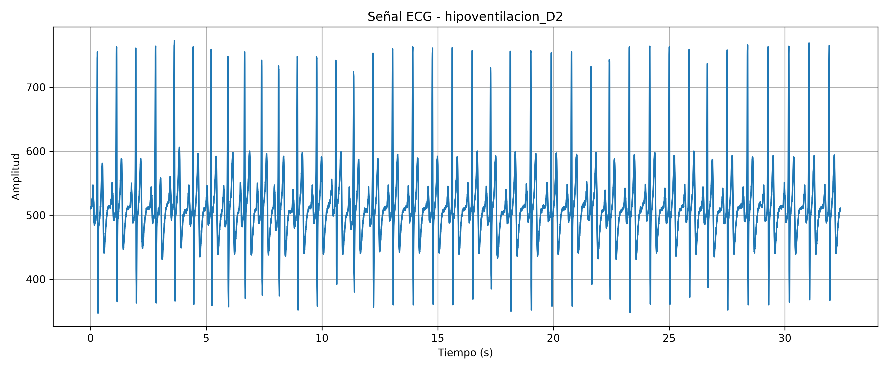

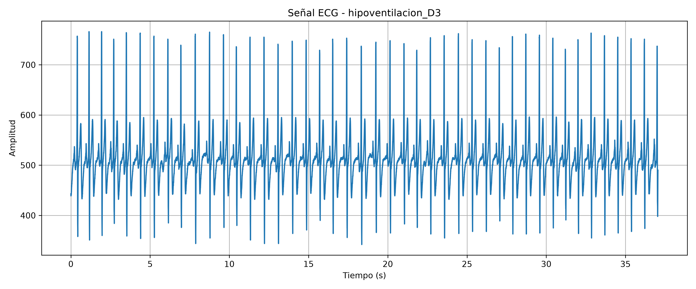

> ANÁLISIS: En la hipoventilación se observa nuevamente separación regular entre los picos, similar al estado basal. No se observa presencia de ruido que afecte la medición y tampoco se observa una disminución considerable de la frecuencia cardiaca.

### Actividad fisica

Finalmente, se registró la señal ECG asociada a la condición de actividad física. Esta adquisición permite comparar el comportamiento de la señal respecto al estado basal y observar los cambios relacionados con la frecuencia cardíaca y la morfología de los ciclos.

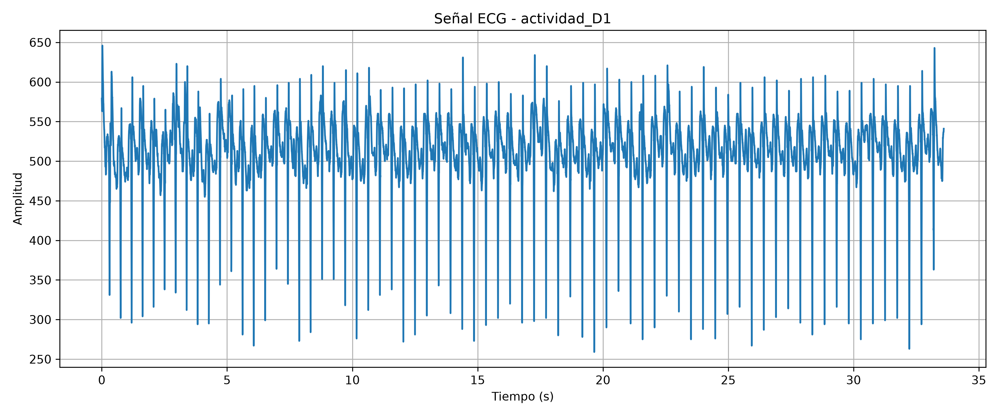

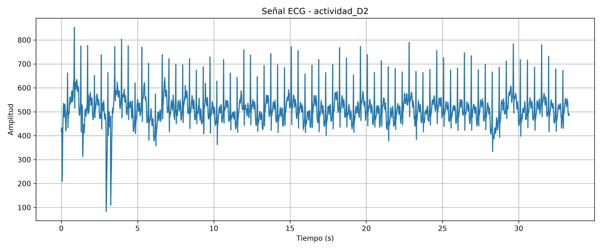

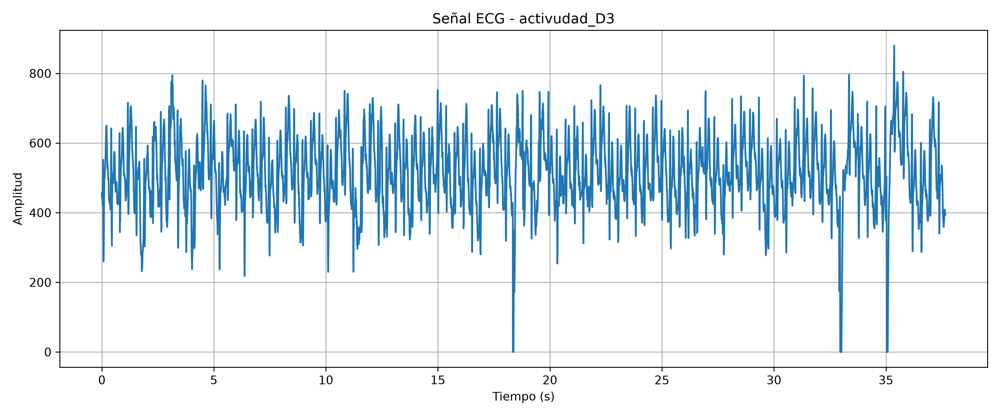

> ANÁLISIS: En la medición con actividad física es donde mejor se aprecian los cambios. La frecuencia cardiaca está notablemente aumentada, se aprecian más irregularidades y la presencia de artefactos. 

## Análisis final y conclusiones

Se observó que la condición fisiológica puede modificar las características temporales de la señal ECG, principalmente la separación entre los picos R y, por lo tanto, la frecuencia cardíaca. Asimismo, las condiciones que involucran cambios en la respiración o movimiento pueden introducir variaciones y artefactos en la señal.

La utilización de las tres derivaciones de Einthoven permitió observar la actividad eléctrica cardíaca desde diferentes direcciones. Por esta razón, una misma actividad cardíaca puede presentar diferencias en amplitud, polaridad y morfología entre las derivaciones I, II y III.
