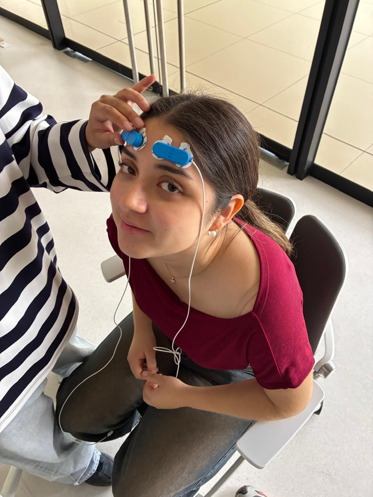
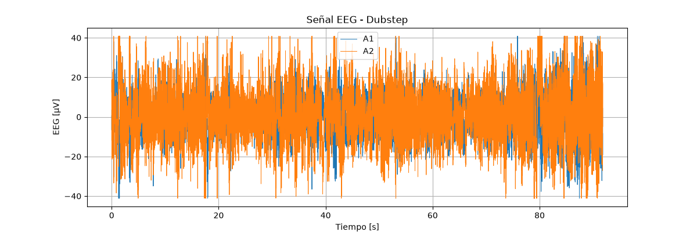
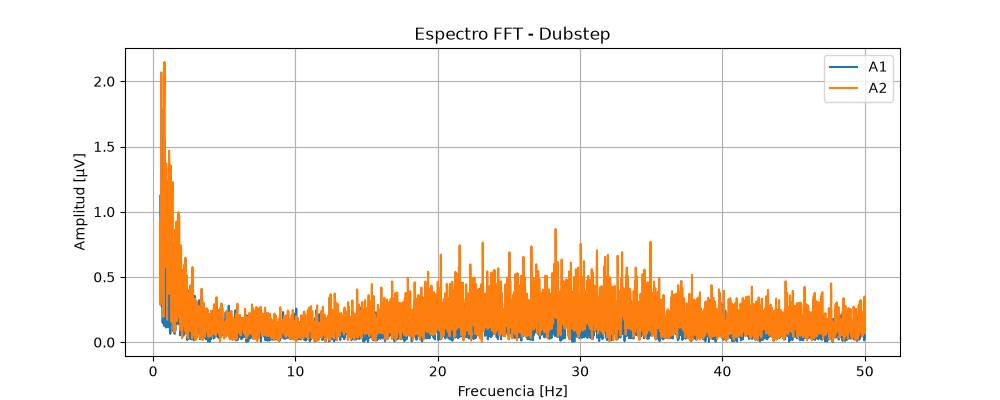
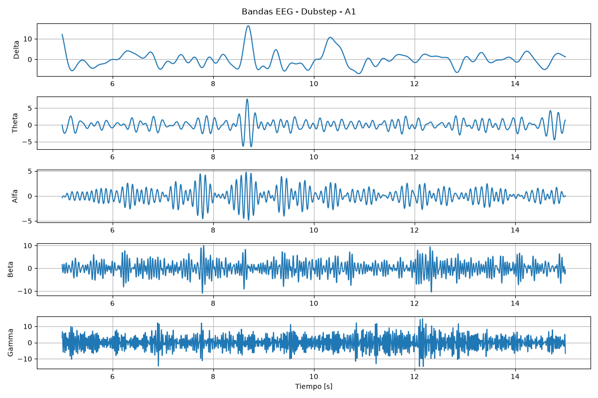
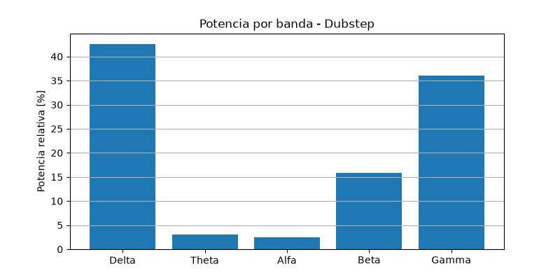
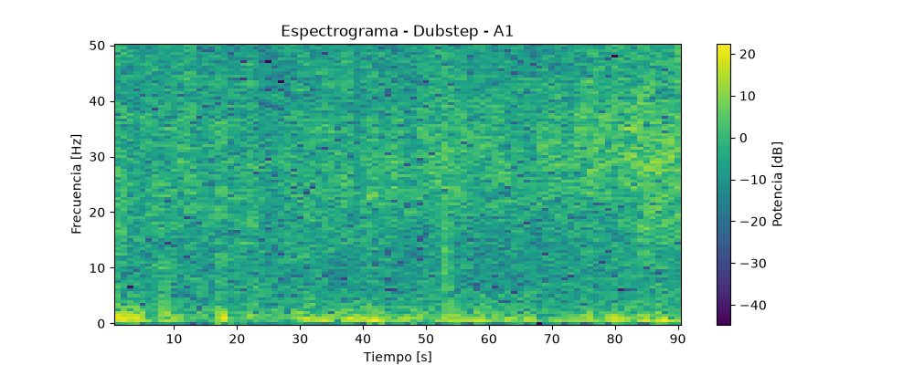

<u>**Informe de laboratorio 6**</u>

**Integrantes:** Julio Alonso Vásquez Tantaleán, Mariel Andrea Brachowicz Suarez, Abigail Alcazar Vargas, Ana Paula Vela Velasquez

<u>Objetivo</u>

Medir la señal EEG con el sensor BITalino en varias situaciones y separarla en bandas (delta, theta, alfa, beta y gamma) usando la transformada de Fourier, para ver cómo cambia en cada situación.

<u>Contextualización</u>

El EEG mide la actividad eléctrica del cerebro con electrodos pegados en la cabeza. La señal se divide en bandas según su frecuencia:

- Delta: 0 a 4 Hz (sueño)
- Theta: 4 a 8 Hz (somnolencia)
- Alfa: 8 a 12 Hz (relajación con ojos cerrados)
- Beta: 12 a 25 Hz (pensar y concentrarse)
- Gamma: más de 25 Hz

La transformada de Fourier sirve para pasar la señal del tiempo a la frecuencia y ver cuánta energía hay en cada banda.

<u>Materiales</u>

- BITalino (r)evolution Core BT
- Sensor EEG (usamos 2 canales: A1 y A2)
- Electrodos con gel
- Programa OpenSignals
- Audio con música lofi y dubstep
- Laptop con Python

*Figura 1. Montaje del experimento en nuestra sujeto de prueba.*

<u>Procedimiento</u>

1. Se limpió con alcohol la frente y la zona detrás de la oreja.
2. Se pegaron los electrodos en el sensor EEG. El electrodo de referencia se pegó detrás de la oreja.
3. Se puso el sensor en la frente. [COMPLETAR: en qué posición quedó cada canal]
4. Se conectó el BITalino por Bluetooth y se abrió OpenSignals con los canales A1 y A2 a 1000 Hz.
5. La persona se quedó sentada, quieta y con la cara relajada.
6. Se guardó un archivo por cada situación:
    - Basal: reposo con ojos cerrados (92 s).
    - Mirar punto: mirar un punto fijo (58 s). 
    - 5 preguntas: sobre cursos que la sujeto de prueba esta llevando.
    - Lofi: música relajada (92 s). 
    - Dubstep: música pesada (92 s).

<u>**Procesamiento de datos y resultados**</u>

Todo se hizo en el codigo: *analisis_fourier.ipynb*

Para el procesamiento de las señales EEG se utilizó como ejemplo el registro obtenido durante la condición Dubstep. La señal fue adquirida mediante dos canales, A1 y A2, con una frecuencia de muestreo de 1000 Hz. Posteriormente, los valores digitales registrados por el sistema fueron convertidos a microvoltios para facilitar su interpretación. 

   
  <em>Figura 2. Señal EEG - Dubstep</em>

La primera etapa del análisis consiste en observar la señal EEG en el dominio del tiempo. Esto permite visualizar cómo varía la amplitud de los canales A1 y A2 durante el registro e identificar posibles cambios bruscos, ruido o saturaciones.

<u>Análisis en frecuencia mediante FFT</u>

Debido a que la señal EEG está formada por diferentes componentes de frecuencia, se aplicó la Transformada Rápida de Fourier (FFT). Esta transformación permite pasar del dominio del tiempo al dominio de la frecuencia e identificar cuáles frecuencias tienen mayor presencia en la señal.

   
  <em>Figura 3: Espectro FFT - Dubstep</em>

En el espectro, el eje horizontal representa la frecuencia en Hz y el eje vertical representa la amplitud de cada componente. Para el análisis EEG se consideran principalmente las frecuencias menores a 50 Hz.

<u>Separación por bandas EEG</u>

A partir del espectro de frecuencia, la señal se separó en las principales bandas EEG: Delta (0.5–4 Hz), Theta (4–8 Hz), Alfa (8–12 Hz), Beta (12–25 Hz) y Gamma (25–45 Hz). Esta separación permite observar de manera independiente la actividad correspondiente a diferentes rangos de frecuencia.

   
  <em>Figura 4: Bandas EEG - Dubstep - A1</em>

<u>Potencia relativa de las bandas</u>

Para comparar la contribución de cada banda a la señal total, se calculó su potencia relativa. De esta manera se puede observar qué rango de frecuencias presenta una mayor presencia durante la condición analizada.

   
  <em>Figura 5: Potencia por banda - Dubstep</em>

Una barra de mayor altura indica que una mayor proporción de la energía de la señal EEG se encuentra dentro de esa banda de frecuencia.

<u>Análisis tiempo-frecuencia</u>

Debido a que la actividad EEG puede cambiar a lo largo del registro, también se generó un espectrograma. A diferencia de la FFT, que muestra el contenido de frecuencia de toda la señal, el espectrograma permite observar cómo cambia la potencia de las distintas frecuencias a través del tiempo.

   
  <em>Figura 6: Espectrograma - Dubstep - A1</em>

En conjunto, estas etapas permiten estudiar la señal EEG tanto en el dominio del tiempo como en el dominio de la frecuencia, además de identificar la contribución de las diferentes bandas cerebrales y sus variaciones durante el registro.

<u>Discusiones y Conclusiones</u>

En la condición basal, la mayor parte de la potencia se concentró en la banda Delta, con valores superiores al 78 %. Sin embargo, parte de esta actividad podría estar influenciada por parpadeos, movimientos o variaciones lentas de la señal. La actividad Alfa fue baja, por lo que no se observó un ritmo alfa claramente predominante.

Durante las preguntas, en el canal A1 se observó una disminución de la potencia Delta y un aumento relativo de Theta y Beta respecto al basal. Esto podría estar relacionado con un mayor nivel de atención o procesamiento cognitivo, aunque los cambios no fueron iguales en todas las preguntas ni entre ambos canales.

Al mirar un punto fijo, se observó un aumento relativo de las bandas Theta, Beta y Gamma en A1. Sin embargo, también se registró mayor saturación de la señal, por lo que parte de estos cambios podría deberse a movimiento o artefactos y no únicamente a actividad cerebral.

La condición Lofi presentó cambios relativamente pequeños respecto al basal. En Dubstep, la mayor potencia se encontró en Delta, seguida de Gamma y Beta. La FFT y el espectrograma también muestran presencia importante de componentes de baja y alta frecuencia, aunque la actividad Gamma debe interpretarse con precaución porque puede verse afectada por actividad muscular o movimientos.

En conjunto, las distintas condiciones produjeron cambios en la distribución de potencia de las bandas EEG. Los resultados permiten identificar tendencias entre estímulos y diferencias entre canales, pero deben interpretarse con cautela debido a la posible presencia de artefactos y al número limitado de mediciones.

<u>Preguntas del cuestionario</u>

*¿Cuáles son las frecuencias importantes? ¿Son iguales en todas las áreas?*
Son delta, theta, alfa, beta y gamma. No son iguales en todas las áreas: por ejemplo, el alfa es más fuerte atrás en la cabeza (occipital) y el beta aparece más al pensar. En nuestra frente predominó delta.

*¿Qué filtro es necesario y por qué?* Un filtro pasabanda. Quita la deriva lenta y el ruido de alta frecuencia, incluyendo el ruido de la red eléctrica (60 Hz). Sin filtro la señal tan pequeña se pierde.

*¿Se puede cambiar el EEG con los pensamientos?* Sí. Cerrar los ojos y relajarse sube el alfa, y resolver problemas sube theta y beta. En nuestros datos las preguntas subieron theta y beta en A1, pero no se puede asegurar que sea solo del cerebro porque los músculos también aumentan beta y gamma.

*Captura de una parte relevante y si es lo esperado.* Ver Figuras 1 y 3. Esperábamos ver alfa en el basal, pero predominó la actividad lenta y los saltos por parpadeos.

*¿Hay diferencia entre FP1 y FP2?* Sí hay diferencia entre A1 y A2. A2 tuvo mayor amplitud que A1 en todas las situaciones. Al ser una sola medición, puede ser por el contacto del electrodo y no por el cerebro.

*¿Qué frecuencias deberían cambiar? ¿Se ve en la señal cruda?* En las preguntas se espera más beta y theta, con música relajada más alfa y con música pesada más beta. En la señal cruda casi no se nota a simple vista, se ve mejor al separar por bandas (Figuras 3 a 6).

*¿La amplitud del EEG es igual al nivel de concentración?* No. La amplitud depende del contacto del electrodo y de los artefactos. El dubstep tuvo la mayor amplitud y no fue donde más concentración había.

<u>Referencias</u>

- PLUX. BITalino Home Guide #3 - Electroencephalography (EEG), 2021.
- Sazgar y Young (2019). Overview of EEG, electrode placement, and montages. Springer.
- Abhang, Gawali y Mehrotra (2016). Technological Basics of EEG Recording and Operation of Apparatus. Academic Press.